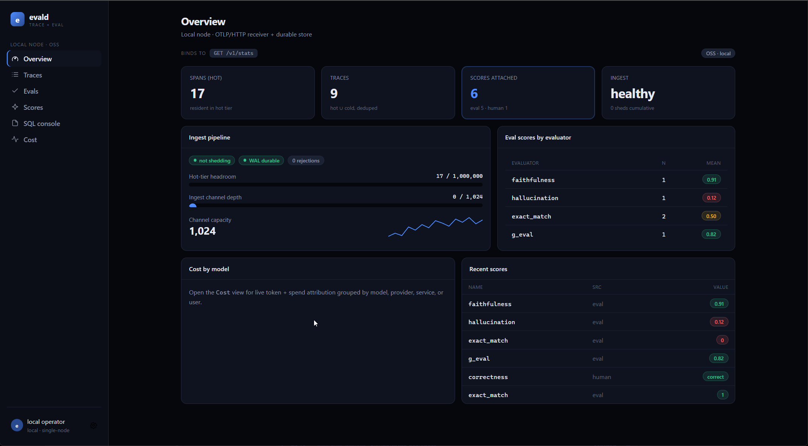
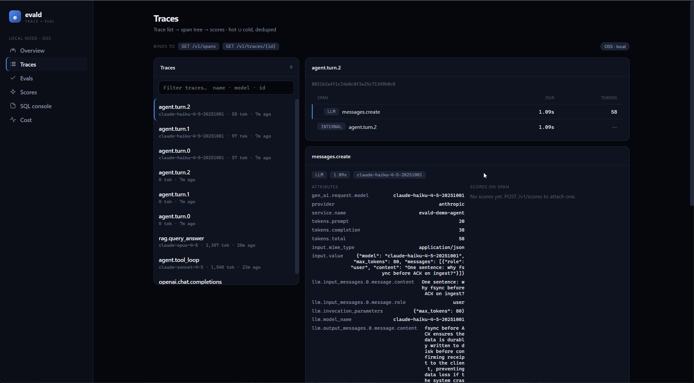
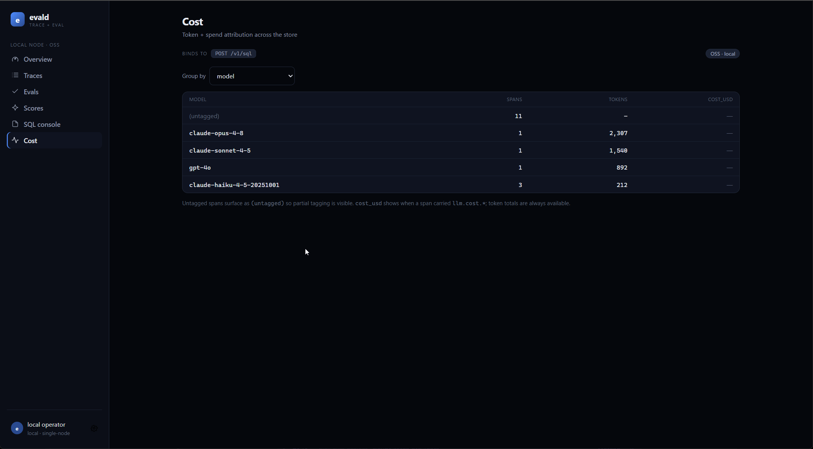
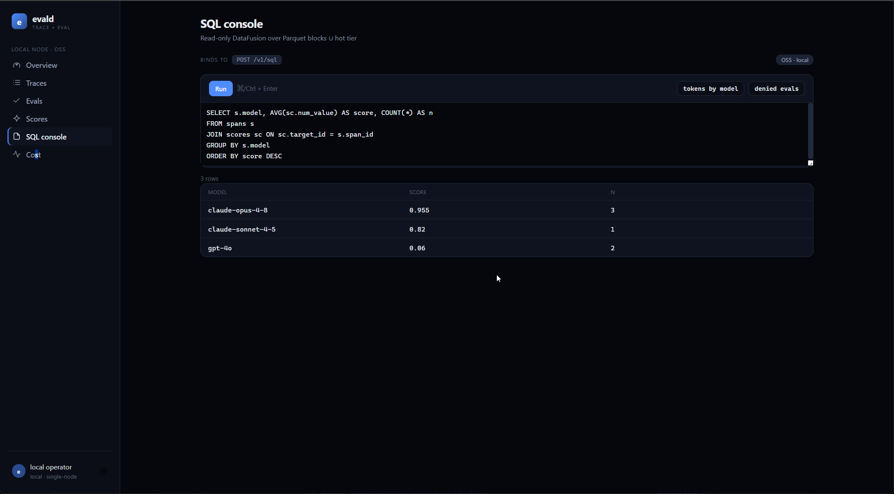
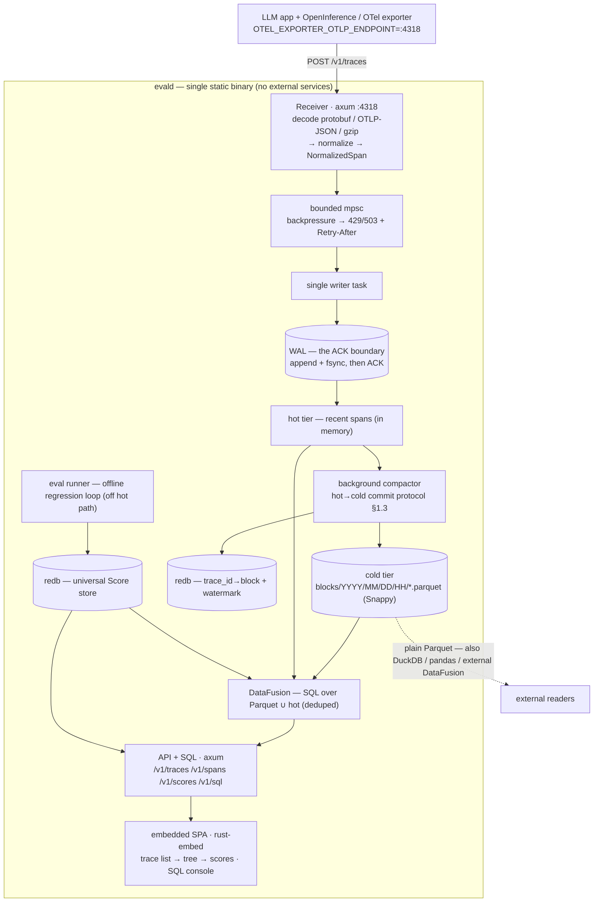
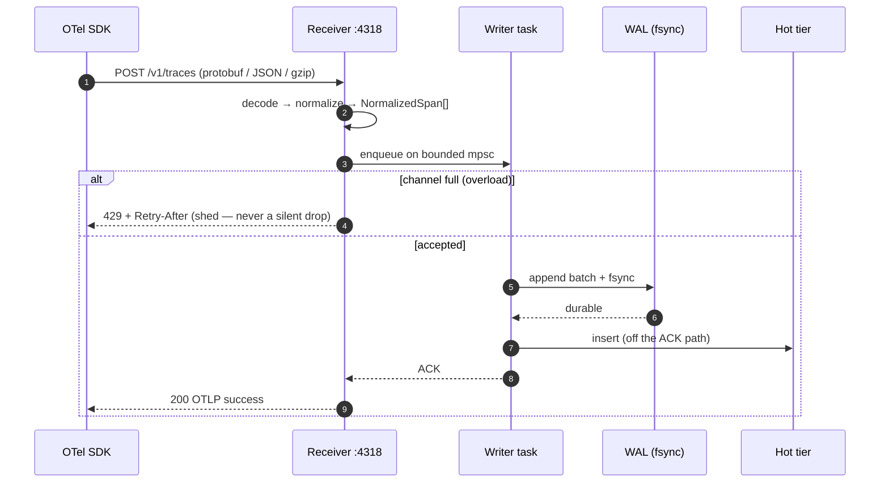
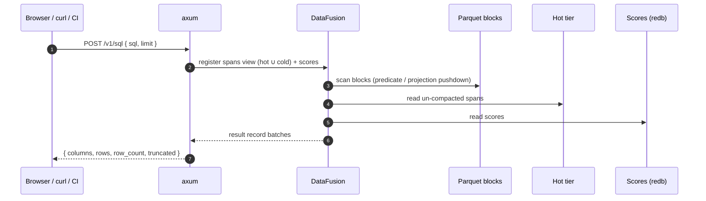
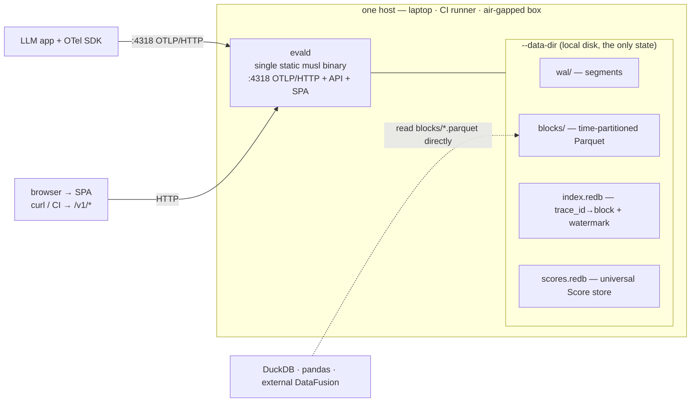

# evald

**evald — an OTel-native trace + eval store in one static binary.** Point your
OpenInference/OTel exporter at `localhost:4318`, see your traces, run evals from a
JSONL dataset, get scores keyed to the exact span. No database, no Python runtime,
no container required — a single static musl binary that runs on your laptop or
inside a locked-down CI runner.

> **Status: v0.2.0.** `evald serve` runs an OTLP/HTTP receiver on
> `:4318` that accepts `POST /v1/traces` in **both** protobuf (gzip-aware) and
> **OTLP-JSON**, **normalizes** each span into one model unifying the OpenInference and
> `gen_ai.*` conventions, and **durably stores** it through a real two-tier engine: a
> fsynced write-ahead log (the ACK boundary) → a background compactor that flushes sealed
> segments to **time-partitioned Parquet** (Snappy), with a **redb** `trace_id`→block
> index + a compaction **watermark**, then truncates the WAL. The hot→cold commit protocol
> is crash-safe — verified with a real `kill -9` *during compaction*: spans come back from
> cold Parquet + WAL replay with no loss and no double-count. The Parquet blocks are plain
> columnar files you can query in DuckDB/pandas. **Scores** are durable too: the universal
> Score object (eval / human / API, targeting a span/trace/session/run) is stored in redb,
> with `POST`/`GET /v1/scores`, `GET /v1/scores/{id}`, and a **Phoenix-compatible**
> `POST /v1/span_annotations`. Read traces back with `GET /v1/spans` and
> `GET /v1/traces/{trace_id}` (hot ∪ cold, deduped); overload sheds with `429 + Retry-After`.
> The **offline eval runner** is live too: `evald eval run` scores a
> JSONL dataset with deterministic Tier-1 evaluators (exact_match, contains, contains_all,
> contains_any, regex, json_valid, non_empty, length_bounds, levenshtein,
> numeric_tolerance), persists per-item + aggregate Scores, and **exits non-zero on a
> threshold regression** (a CI gate). And `evald eval compare <runA> <runB>` reads those
> persisted aggregates back and **diffs two runs by evaluator** — with `--fail-on-regression
> [--tolerance]` it's a second CI gate that fails the build when a run gets worse, and with
> **`--significance`** that gate is **statistically honest**: a drop fails the build only when
> a dependency-free **Welch's two-sample t-test** shows the `(1 − α)` confidence interval
> excludes zero — so sampling noise on a small dataset doesn't flag a phantom regression (the
> aggregate Score carries the per-run n/mean/variance for the test). The MVP pieces are all in:
> **DataFusion SQL over the Parquet blocks** (`POST /v1/sql` + `evald query`, with `spans` ∪
> `scores` tables so the OTel-native join is one query away), and the **embedded SPA**
> (rust-embed — trace list → trace tree → scores, plus a SQL console; bundled into the binary,
> works air-gapped) served at `/`. See [`PLAN.md`](./PLAN.md) §4 and the
> [Architecture](#architecture) diagrams. Last updated 2026-07-13.

## The console

The embedded console (served at `/`, bundled into the binary) — one edition-aware SPA:
the OSS node shows the **Local node · OSS** surfaces below; an EE fleet node lights up an
extra **Fleet · EE** group. Screenshots are the OSS build against live data (real
Anthropic + demo traces).



<table>
<tr>
<td width="50%"><a href="./docs/assets/console-traces.png"></a><br><b>Traces</b> — trace list → span tree → span detail (real <code>gen_ai.*</code> attributes + token usage).</td>
<td width="50%"><a href="./docs/assets/console-cost.png"></a><br><b>Cost</b> — token + spend attribution, grouped by model / provider / service / user.</td>
</tr>
<tr>
<td width="50%"><a href="./docs/assets/console-sql.png"></a><br><b>SQL console</b> — read-only DataFusion over the <code>spans</code> ∪ <code>scores</code> tables.</td>
<td width="50%"><i>Evals</i>, <i>Scores</i>, and account <i>Settings</i> round out the OSS group; <b>Tenants · Members · Billing · Audit · Fleet · Judge keys</b> appear on an EE fleet node. See <a href="./docs/INSTRUMENTATION.md">docs/INSTRUMENTATION.md</a> to point your own app at it.</td>
</tr>
</table>

## What it is

evald is one process / one binary that combines two things that today only exist
separately:

1. an **OTLP/OpenInference trace store** with embedded, restart-durable storage that
   absorbs high-write OTLP span bursts, and
2. a **built-in offline eval-regression runner** — datasets, deterministic scorers,
   `eval run` / `eval compare` with CI exit codes, run-vs-run diffing.

The focus is the **offline dataset/experiment eval-regression loop with CI exit codes
in a zero-runtime static binary**, aimed at air-gapped / regulated / CI environments
where a Python runtime or a container is disqualifying.

## Performance

Measured on one box: with the
group-commit writer evald ingests **56k spans/s at 32 connections (95k with 100-span
batches), fsynced-before-ACK, on 1.8 cores with an 8.5 MB idle RSS**. Accepted spans
are durable (the WAL append is the ACK boundary); beyond ingest+flush throughput evald
applies backpressure and sheds with `429/503 + Retry-After` rather than dropping
silently.

## Getting started

The target UX (✅ = works today at PoC step 8; the rest land per [`PLAN.md`](./PLAN.md) §4):

```bash
# 1. run the store (single binary, no dependencies)
evald serve                       # ✅ OTLP/HTTP receiver on :4318 + durable store + query/SQL API + UI

# 2. repoint any OpenInference/OTel SDK — one env var
export OTEL_EXPORTER_OTLP_ENDPOINT=http://localhost:4318
#    ... run your LLM app; spans are normalized + durably stored (✅ today) ...
#    full walkthrough (auto-instrument Anthropic/OpenAI/LangChain, manual spans,
#    the attributes evald reads) → docs/INSTRUMENTATION.md

# 3. read traces back                               (✅ today)
curl localhost:4318/v1/spans                 # recent spans (?trace_id=&limit=)
curl localhost:4318/v1/traces/<trace_id>     # one trace, in arrival order
open  http://localhost:4318/                 # ✅ the embedded UI — trace list → tree → scores

# 4. attach a score to a span/trace                 (✅ today)
curl localhost:4318/v1/scores -d '{"span_id":"<id>","name":"exact_match","value":1}'
curl 'localhost:4318/v1/scores?span_id=<id>'           # scores on a span
#   Phoenix clients can POST to /v1/span_annotations ({"data":[...]}) instead.

# 5. run an offline eval and gate CI on it                            (✅ today)
evald eval run --config eval.yaml       # ✅ exit-nonzero if a threshold regresses
evald eval compare run_a run_b          # ✅ diff two runs' aggregates by evaluator
evald eval compare run_a run_b --fail-on-regression --tolerance 0.02
#                                       # ✅ exit-nonzero if a run regressed > tolerance
evald eval compare run_a run_b --fail-on-regression --significance --alpha 0.05
#   ✅ statistically honest gate: a drop fails CI only when Welch's t shows it's beyond
#      sampling noise (the 95% CI on the delta excludes 0) — small-dataset noise won't flag.

# 5b. (optional) Tier-3 LLM-as-judge — BYO-key, OFF by default, results cached.
cargo build --features judge          # the network backend is feature-gated
export ANTHROPIC_API_KEY=sk-ant-...                 # (or OPENAI_API_KEY) — read at call time only
evald eval run --config examples/eval/judge.yaml --data-dir /tmp/evald --estimate   # preview $ first
evald eval run --config examples/eval/judge.yaml --data-dir /tmp/evald              # then run
#   rails: g_eval · qa_correctness · answer_relevancy · faithfulness · hallucination ·
#          context_precision · context_recall · toxicity · bias.
#   --estimate previews token+cost offline (no key, no call). Judge means flow through the same
#   threshold gate + significance as Tier-1; re-runs are free (cached in judge_cache.redb).

# 5c. calibrate a judge against your own human labels — measure trust (✅ today, OFFLINE, no key)
evald eval calibrate --judge judge_g_eval --data-dir /tmp/evald
#   pairs each judge score with the HUMAN annotation on the same span (span_id IS the join key)
#   and reports bias (judge−human), MAE/RMSE, Pearson, a confidence interval on the bias, and the
#   bias-correcting affine map  human ≈ intercept + slope·judge.  --fail-on-divergence makes it a
#   CI gate against judge drift.

# 6. query the store with SQL (DataFusion over the Parquet blocks ∪ scores)   (✅ today)
curl localhost:4318/v1/sql -d '{"sql":"SELECT model, COUNT(*) n, SUM(total_tokens) tok FROM spans GROUP BY model ORDER BY tok DESC"}'
evald query "SELECT s.model, AVG(sc.num_value) FROM spans s \
             JOIN scores sc ON sc.target_id = s.span_id GROUP BY s.model"
#   the OTel-native join — span_id IS the key — in one line, no ETL.

# 7. attribute token spend                                                    (✅ today)
evald cost --by model        # spans · tokens · cost_usd per model (also: user|session|service|provider)
#   untagged spans are surfaced as (untagged) so partial tagging is visible; cost_usd
#   shows when a span carried `llm.cost.*`, token totals are always available.
```

**Run an eval now** — there's a ready-made dataset + config under
[`examples/eval/`](./examples/eval):

```bash
evald eval run --config ./examples/eval/eval.yaml --data-dir /tmp/evald
#   prints a per-evaluator report (mean / pass_rate / threshold / pass|FAIL),
#   persists the scores, and exits 0 (all thresholds met). Bump exact_match's
#   threshold to 0.90 in the config to watch the CI gate fail with exit code 1.
#   Note the printed `run_id:` — that's what `eval compare` diffs.

# Then diff two runs by evaluator (each `eval run` prints a fresh run_id):
evald eval compare <run_id_a> <run_id_b> --data-dir /tmp/evald
#   prints  evaluator | run_a | run_b | delta | change  per evaluator.
#   Add --fail-on-regression [--tolerance 0.02] to exit non-zero when run B
#   dropped more than the tolerance below run A — a second, run-vs-run CI gate.
```

**Try it now (no SDK needed)** — the example emits a demo OTLP protobuf payload; pipe
it in, then read it back. It survives a restart (the span is fsynced to the WAL):

```bash
evald serve --data-dir /tmp/evald &                             # listens on 127.0.0.1:4318
cargo run --example otlp_demo_payload \
  | curl --data-binary @- -H 'Content-Type: application/x-protobuf' \
         http://127.0.0.1:4318/v1/traces
curl -s http://127.0.0.1:4318/v1/spans                          # -> the normalized span as JSON
# kill -9 the server, `evald serve --data-dir /tmp/evald` again, GET /v1/spans -> still there.
```

## Exposing evald on a network (auth)

By default `evald serve` binds **loopback** (`127.0.0.1:4318`) and runs with **no
authentication** — it is a local / single-tenant tool, and the threat model is
untrusted *input* on a *trusted* network (your laptop, a locked-down CI runner). Do
not put that default on a shared or public network unguarded.

For network exposure, evald ships an **optional bearer-token gate** (off by default).
Arm it and every request must carry `Authorization: Bearer <token>` — over HTTP
(OTLP ingest, the whole `/v1/*` API, and the SPA; a missing/wrong token is `401`)
and over OTLP/gRPC (the `authorization` metadata; a missing/wrong token is gRPC
`UNAUTHENTICATED`):

```bash
# Preferred — tokens in a file readable only by the evald user (one per line,
# `#` comments): keeps the secret out of the process list and shell history.
printf '%s\n' "$(openssl rand -hex 24)" > /etc/evald/tokens && chmod 600 /etc/evald/tokens
evald serve --otlp-http 0.0.0.0:4318 --auth-token-file /etc/evald/tokens
#   rotate:  add a new line, reload clients, then remove the old one.
#   env:     EVALD_AUTH_TOKEN=tok1,tok2 evald serve …   (comma-separated list)
#   flag:    evald serve --auth-token "<token>"         (trusted single-user host only —
#                                                         argv is visible in `ps`)

# clients attach the token as a header:
curl http://HOST:4318/v1/spans -H "Authorization: Bearer $EVALD_TOKEN"
export OTEL_EXPORTER_OTLP_HEADERS="Authorization=Bearer $EVALD_TOKEN"   # OTLP SDKs
```

Prefer `--auth-token-file` (or `EVALD_AUTH_TOKEN`) on shared hosts: a token passed
as `--auth-token` on the command line is visible in the process list (`ps`,
`/proc/<pid>/cmdline`) to other local users, so the flag form is only appropriate on
a trusted single-user host. Tokens are ≥16 printable-ASCII chars (rejected at boot
otherwise), matched by SHA-256 digest, and never logged; multiple tokens support
rotation and per-client revocation. Binding off-loopback with no token logs a loud
startup warning.

This is a **shared-secret gate, not TLS and not per-user identity.** If the network
between clients and evald is untrusted, terminate TLS at a reverse proxy — nginx,
Caddy, or an mTLS mesh in front of any app, zero code changes — even with the token
gate on. For per-tenant identity / OIDC, use the separately-licensed `ee`
fleet layer. Full details: [OPERATIONS.md § Security posture](./docs/OPERATIONS.md#security-posture)
and [SECURITY.md](./SECURITY.md).

## Architecture

### High-level view

evald is **one process / one static binary** with no external services. An OTLP
receiver (HTTP `:4318` in MVP; gRPC `:4317` in Beta) decodes + normalizes each span and
hands it to a **single in-process writer task**. That writer appends to a **durable WAL
— the ACK boundary** (fsync *before* the client ACK), then inserts into an in-memory
**hot tier**. A **background compactor** flushes sealed WAL segments to
**time-partitioned Parquet** (the cold tier) under a crash-safe commit protocol, indexed
by **redb** (`trace_id`→block + a compaction watermark). **DataFusion** (pure-Rust, no
C++ → clean static musl) runs SQL over the cold Parquet blocks unioned with the hot
tier; the **axum** API, the embedded **SPA**, and the offline **eval runner** sit on top.
The eval runner and analytical queries run **off the ingest hot path**, so a scan never
contends with the OTLP firehose.



### Event / call flow

**Ingest** — the WAL append is the ACK boundary, so client latency is decoupled from
compaction; on overload evald sheds explicitly rather than dropping silently:



**Query** — `POST /v1/sql` (and `evald query`, and the SPA's SQL console) register
`spans` (hot ∪ cold, deduped by `(trace_id, span_id)`) and `scores`, then run DataFusion:



### Infrastructure / deployment

No database, no container, no runtime to provision — copy one binary next to one
local `--data-dir`. The same artifact runs on a laptop, inside a locked-down CI runner,
or on an air-gapped host; the cold blocks are plain Parquet that external tools can read
directly off disk:



Durability guarantee, stated honestly: **accepted spans are durable; under load
beyond ingest+flush throughput evald applies backpressure and sheds with explicit
`429/503 + Retry-After` — it never silently drops.** It is not a no-loss-under-
arbitrary-load system. See [`PLAN.md`](./PLAN.md) for the hot→cold commit protocol, the
crate stack, and the data model.

## Docs

- [`PLAN.md`](./PLAN.md) — phased build plan (PoC → MVP → Beta → GA), architecture,
  data model, crate stack. *(public)*
- [`docs/CONFIG.md`](./docs/CONFIG.md) — every knob: `serve`/`eval`/`query`/`cost` CLI
  flags + `EVALD_*` env fallbacks, the eval YAML (evaluators, judges, thresholds),
  fixed limits, on-disk format/compat notes. *(public)*
- [`docs/INSTRUMENTATION.md`](./docs/INSTRUMENTATION.md) — connect your LLM app: point
  any OpenTelemetry / OpenInference exporter at `:4318`, the attributes evald reads
  (GenAI + OpenInference dialects, tokens, cost), and how to attach scores. *(public)*
- [`docs/API.md`](./docs/API.md) — every HTTP endpoint with request/response examples
  and error codes (429 shed, 413 cap, the read-only SQL guard). *(public)*
- [`docs/OPERATIONS.md`](./docs/OPERATIONS.md) — ops runbook: the `--data-dir` state +
  crash-recovery semantics, backup/restore, upgrade, monitoring, symptom-first
  troubleshooting, security posture. *(public)*

## License

Apache-2.0.
